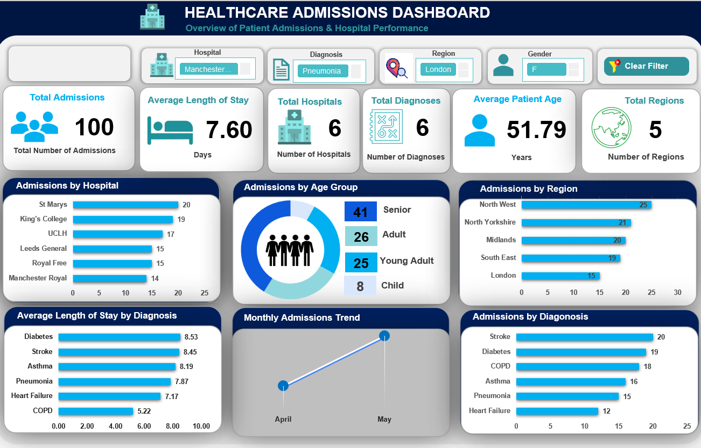

# Healthcare Admissions Analytics – Excel

## Project Overview

This project analyzes healthcare admission data using Microsoft Excel to provide a clear view of patient admissions, hospital activity, diagnoses, demographics, length of stay, regional distribution, and monthly admission patterns.

The aim was to transform raw healthcare records into an interactive analytical dashboard that can support hospital managers and healthcare decision-makers in understanding patient demand and operational performance.

The project covers the complete Excel analytics workflow, including data cleaning, transformation, analysis, PivotTables, PivotCharts, KPI development, slicers, dashboard design, and automated filter controls.

---

## Business Questions

The analysis was developed to answer questions such as:

- How many patient admissions were recorded?
- Which hospitals handled the highest number of admissions?
- Which diagnoses were most common?
- Which age groups accounted for the largest number of admissions?
- What was the average patient age?
- What was the average length of hospital stay?
- Which regions recorded the highest admission activity?
- How did admissions change from month to month?
- Which diagnoses were associated with greater admission volumes?
- How can hospital management use admission data to support resource planning?

---

## Dataset

The cleaned dataset contains **100 patient admission records** covering information such as:

- Admission ID
- Patient age
- Gender
- Hospital
- Diagnosis
- Region
- Admission date
- Discharge date
- Length of stay
- Age group
- Admission month

The workbook is organized into four main worksheets:

- **Admissions** – Original healthcare admission data
- **Fact_Admission** – Cleaned and transformed dataset
- **Analysis** – PivotTable-based analytical calculations
- **HA Dashboard** – Interactive healthcare admissions dashboard

---

## Dashboard KPIs

The dashboard provides a high-level view of healthcare activity through key indicators including:

- **100 Total Admissions**
- **6 Hospitals**
- **6 Diagnosis Categories**
- **5 Regions**
- **51.8 Years Average Patient Age**
- **7.6 Days Average Length of Stay**

---

## Key Findings

- A total of **100 patient admissions** were analyzed across six hospitals.
- **Senior patients** represented the largest age-group segment, accounting for 41 admissions.
- **Stroke** recorded the highest number of admissions with 20 cases, followed closely by **Diabetes with 19 cases**.
- **St Marys** recorded the highest hospital admission volume with 20 admissions.
- The **North West region** recorded the highest number of admissions with 25 cases.
- Monthly analysis showed **51 admissions in May**, compared with 49 admissions in April.
- Long hospital stays represented the largest length-of-stay category.
- The average admitted patient was approximately **52 years old**.
- Patients stayed in hospital for approximately **7.6 days on average**.

---

## Business Insights

The analysis indicates that patient admissions are not evenly distributed across hospitals, diagnoses, age groups, or geographic regions.

Higher admission volumes among senior patients suggest that hospitals may need to allocate greater resources toward age-related healthcare requirements.

The concentration of admissions for Stroke and Diabetes also highlights areas where hospital management may need stronger capacity planning, clinical resources, specialist support, and preventive healthcare programs.

Regional and hospital-level differences can help management identify where demand is highest and where staffing, beds, equipment, and other operational resources may require adjustment.

---

## Recommendations

Healthcare management should:

- Monitor high-volume diagnoses such as Stroke and Diabetes more closely.
- Align staffing and hospital resources with facilities experiencing higher admission volumes.
- Strengthen capacity planning for senior patients.
- Monitor average length of stay to identify opportunities for improving patient flow.
- Use monthly admission trends to anticipate periods of increased hospital demand.
- Compare hospital and regional performance regularly to improve resource allocation.
- Maintain interactive reporting to allow management to investigate admission patterns by hospital, diagnosis, region, and gender.

---

## Excel Skills Demonstrated

- Microsoft Excel
- Data Cleaning
- Data Transformation
- Power Query
- PivotTables
- PivotCharts
- Excel Formulas
- KPI Development
- Interactive Slicers
- VBA / Macro-enabled Workbook
- Automated Filter Reset
- Conditional Formatting
- Healthcare Analytics
- Dashboard Design
- Data Visualization
- Business Analysis
- Data Storytelling

---

## Dashboard Features

The dashboard includes interactive filters for:

- Hospital
- Diagnosis
- Region
- Gender

A **Clear Filter** control allows users to reset dashboard filters and return to the overall healthcare admissions view.

The dashboard also provides analysis of:

- Admissions by Hospital
- Admissions by Diagnosis
- Admissions by Region
- Admissions by Age Group
- Monthly Admission Trends
- Average Length of Stay

---

## Dashboard Preview



---

## Repository Structure

```text
Healthcare-Admissions-Analytics-Excel/
│
├── README.md
├── Healthcare_Admissions_Dataset_Analytics.xlsm
└── Healthcare_Admissions_Dashboard.png
